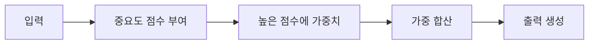
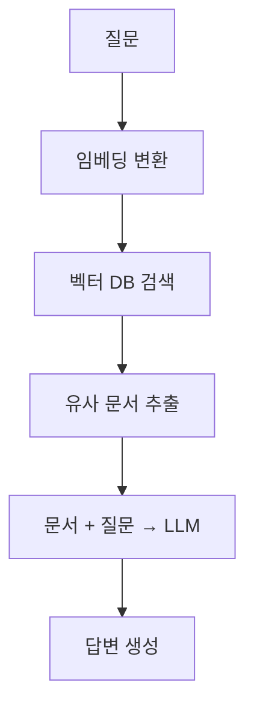

# 🤖 AI 개발자 용어집

## 1. 수학 기초

### 벡터 (Vector)

**정의**: 크기(magnitude)와 방향(direction)을 가진 수학적 객체. 여러 숫자가 순서대로 배열된 형태.

> 💡 **비유**: 화살표와 같습니다. 화살표의 길이가 크기, 화살표가 가리키는 방향이 방향입니다.

#### 기본 개념

```
벡터 = [숫자1, 숫자2, 숫자3, ...]

예시:
[3, 4]        → 2차원 벡터 (x축 3, y축 4)
[1, 2, 3]     → 3차원 벡터
[0.1, 0.5, -0.3, 0.8, ...] → 고차원 벡터 (AI에서 자주 사용)
```

#### 벡터의 표현

- **기하학적**: 화살표로 표현 (크기와 방향)
- **대수적**: 숫자 배열로 표현 `[x, y, z]`
- **차원(Dimension)**: 벡터에 포함된 숫자의 개수

#### AI에서의 중요성

```
✅ 단어 임베딩 = 벡터
   예: '고양이' → [0.2, -0.1, 0.8, 0.3, ...] (128차원)

✅ 이미지 = 픽셀 값들의 벡터
   예: 28×28 이미지 = 784차원 벡터

✅ 유사도 계산 = 벡터 간 거리
   가까운 벡터 = 유사한 의미/특성

✅ 신경망 연산 = 벡터 연산
   입력 × 가중치 = 출력
```

#### 벡터 연산 예시

```python
# 벡터 덧셈
[1, 2] + [3, 4] = [4, 6]

# 스칼라 곱셈
3 × [1, 2] = [3, 6]

# 내적 (Dot Product) - 유사도 계산
[1, 2] · [3, 4] = 1×3 + 2×4 = 11
```

**핵심**: AI에서 모든 데이터(텍스트, 이미지, 음성)는 결국 벡터로 변환되어 처리됩니다.

---

### 선형대수학 (Linear Algebra)

**정의**: 벡터, 행렬, 선형 변환을 다루는 수학 분야. AI/ML의 핵심 수학적 기반.

#### 핵심 개념

- **벡터(Vector)**: 크기와 방향을 가진 수의 배열
- **행렬(Matrix)**: 2차원 수 배열, 데이터와 변환 표현
- **내적(Dot Product)**: 두 벡터의 유사도 계산
- **행렬 곱셈**: 신경망의 핵심 연산
- **고유값/고유벡터**: 차원 축소(PCA)에 사용

#### AI에서의 활용

```
• 이미지 = 픽셀 행렬
• 임베딩 = 고차원 벡터
• 가중치(Weight) = 행렬
• 신경망 레이어 = 행렬 곱셈 연산
```

**예시**: 128차원 단어 임베딩은 128개 숫자로 이루어진 벡터입니다.  
벡터 연산: `'king' - 'man' + 'woman' = 'queen'`

---

### 확률과 통계 (Probability and Statistics)

**정의**: 불확실성을 다루는 수학 분야. 머신러닝은 근본적으로 확률론적 접근을 사용.

#### 핵심 개념

- **확률 분포**: 데이터가 어떻게 분포하는지 표현
- **정규 분포(Gaussian)**: 가장 흔한 분포 (종 모양)
- **평균(Mean)**: 데이터의 중심
- **분산(Variance)**: 데이터의 퍼짐 정도
- **베이즈 정리**: 조건부 확률 계산

#### AI에서의 활용

- 분류 모델의 출력 = 확률 (예: 고양이일 확률 85%)
- 가중치 초기화 = 정규 분포에서 랜덤 샘플링
- 손실 함수 = 통계적 거리 측정
- 불확실성 추정 = 확률 분포 모델링

**예시**: 스팸 필터는 '스팸일 확률'을 계산합니다. 베이즈 정리를 사용해 '이 단어들이 있을 때 스팸일 확률'을 추정합니다.

---

### 미적분학 (Calculus)

**정의**: 변화율과 누적을 다루는 수학 분야. 신경망 학습의 핵심 원리.

#### 핵심 개념

- **미분(Derivative)**: 순간 변화율, 기울기
- **편미분(Partial Derivative)**: 여러 변수 중 하나에 대한 미분
- **경사(Gradient)**: 모든 편미분의 벡터
- **체인 룰(Chain Rule)**: 합성 함수의 미분

#### AI에서의 활용

- **경사 하강법(Gradient Descent)**: 손실을 줄이는 방향 찾기
- **역전파(Backpropagation)**: 체인 룰로 기울기 계산
- **최적화**: 손실 함수의 최소값 찾기

> 💡 **비유**: 안개 낀 산에서 내려가려면 발 주변의 경사를 느껴보고 가장 가파른 방향으로 한 걸음씩 내려갑니다. 이것이 경사 하강법입니다.

**핵심 공식**:

```
새 가중치 = 기존 가중치 - (학습률 × 경사)
```

---

### 가중치 (Weight)

**정의**: 신경망이 학습하는 파라미터로, 입력 데이터에 곱해지는 숫자. 모델의 '지식'이 저장된 곳.

> 💡 **비유**: 음량 조절 다이얼과 같습니다. 중요한 신호는 크게(큰 가중치), 덜 중요한 신호는 작게(작은 가중치) 만듭니다.

#### 작동 방식

1. 입력에 가중치를 곱함
2. 모든 가중치 곱셈 결과를 더함
3. 활성화 함수를 통과
4. 학습 중 경사 하강법으로 가중치 업데이트

#### 예시: 스팸 필터

```
• '무료' 단어 가중치: +0.8 (스팸 가능성 높임)
• '회의' 단어 가중치: -0.3 (정상 메일 가능성 높임)
```

**모델 크기**: GPT-3는 **1,750억 개의 가중치**(파라미터)를 가지고 있습니다. 이것이 모델의 '175B 파라미터'의 의미입니다.

---

## 2. 머신러닝 기초

### 양자화 (Quantization)

**정의**: 모델 내부의 복잡한 숫자(예: 32비트 실수)를 단순한 숫자(예: 4비트 또는 8비트 정수)로 변환하는 기술.

**목적**: 모델의 용량을 획기적으로 줄이고 계산 속도를 높임. 다만 정확도를 트레이드오프.

#### 비트 선택 가이드

| 비트      | 용도           | 특징                    |
| --------- | -------------- | ----------------------- |
| **8비트** | 서버급 성능    | 정교함이 최우선         |
| **4비트** | 개인 PC/모바일 | 최대한 큰 모델을 빠르게 |

> 💡 **핵심 개념**: 비트 수가 줄어든다는 것은 숫자를 표현할 수 있는 '칸'이 줄어든다는 뜻입니다.

**최신 기술**: QLoRA 같은 혁신적인 알고리즘 덕분에 4비트의 단점이 많이 보완되었습니다.

---

### NLP (자연어 처리)

**정의**: 컴퓨터가 인간의 언어를 이해하고, 해석하고, 생성할 수 있게 만드는 인공지능의 한 분야.

#### 왜 어려운가?

인간의 언어에는 **모호성**이 있습니다.

**예시**:

```
"차를 마시며 차를 보니 차가 막힌다."

• 첫 번째 '차': 마시는 차 (Tea)
• 두 번째 '차': 자동차 (Car)
• 세 번째 '차': 교통 상황
```

사람은 문맥에 따라 즉시 구분하지만, 컴퓨터에게는 매우 어려운 과제였습니다.

**발전**: 최근에는 **Deep Learning**과 **Large Language Models(LLM)** 덕분에 이 문제가 비약적으로 해결되었습니다.

---

### 토크나이저 (Tokenizer)

**정의**: 인공지능이나 컴퓨터가 인간의 언어를 이해할 수 있도록, 문장을 최소 의미 단위인 토큰으로 잘라내는 도구.

#### 예시

```python
입력: "안녕하세요, AI 개발자님!"

토큰화: ["안녕하세요", ",", "AI", "개발자", "님", "!"]
```

**중요성**: 토크나이저의 품질이 모델 성능에 큰 영향을 미칩니다. 언어와 도메인에 따라 적절한 토크나이저를 선택해야 합니다.

---

### 데이터 전처리 (Data Preprocessing)

**정의**: 수집된 원시 데이터(Raw Data)를 분석이나 머신러닝 모델 학습에 적합한 형태로 정리하고 변환하는 모든 과정.

#### 주요 작업

- ✅ **결측치 처리**: 누락된 데이터를 제거하거나 채움
- ✅ **이상치 제거**: 극단적인 값을 찾아서 제거
- ✅ **정규화/표준화**: 데이터의 스케일을 조정
- ✅ **인코딩**: 범주형 데이터를 숫자로 변환
- ✅ **피처 엔지니어링**: 새로운 특성 생성

> ⚠️ **중요성**: _"쓰레기가 들어가면 쓰레기가 나온다(Garbage In, Garbage Out)."_  
> 데이터 전처리가 모델 성능의 **80%**를 결정합니다.

---

## 3. 딥러닝 & LLM

### LLM (대규모 언어 모델)

**정의**: 수십억~수천억 개의 파라미터를 가진 거대한 신경망 언어 모델. 방대한 텍스트 데이터로 학습되어 인간 수준의 언어 이해와 생성이 가능.

#### 주요 LLM

| 모델       | 개발사    | 특징                       |
| ---------- | --------- | -------------------------- |
| **GPT-4**  | OpenAI    | 멀티모달, 가장 강력한 성능 |
| **Claude** | Anthropic | 긴 컨텍스트(200K 토큰)     |
| **Llama**  | Meta      | 오픈소스, 상업적 이용 가능 |
| **Gemini** | Google    | 구글의 차세대 모델         |

#### 특징

- 🎯 **창발적 능력(Emergent Abilities)**: 학습하지 않은 작업도 수행
- 📚 **Few-shot Learning**: 예시만으로 새 작업 학습
- 🧠 **Chain-of-Thought**: 단계별 추론 가능
- 🔄 **다중 작업 수행**: 번역, 요약, 코딩, 분석 등

#### 학습 과정

```
1. 사전 학습(Pre-training)
   └─ 인터넷 텍스트로 언어 패턴 학습

2. 파인튜닝(Fine-tuning)
   └─ 특정 작업에 맞게 조정

3. RLHF
   └─ 인간 피드백으로 정렬
```

#### 비용과 성능

- 💰 학습 비용: 수백만~수천만 달러
- 💳 API 비용: 토큰 기반 과금 (입력 + 출력)
- 🖥️ 추론 비용: GPU 필요 (클라우드 활용)

---

### 트랜스포머 아키텍처

**정의**: 현대 AI의 핵심 아키텍처로, _"Attention is All You Need"_ 논문(2017)에서 소개된 신경망 구조. 거의 모든 LLM의 기반.

#### 핵심 구조

```
┌─────────────┬──────────────────────────────┐
│   구조      │         대표 모델            │
├─────────────┼──────────────────────────────┤
│ 인코더      │ BERT (입력 이해)             │
│ 디코더      │ GPT (출력 생성)              │
│ 인코더-디코더│ T5, BART (번역 등)           │
└─────────────┴──────────────────────────────┘
```

#### 핵심 메커니즘

1. **Self-Attention**  
   문장 내 모든 단어 간 관계를 동시에 파악
2. **Multi-Head Attention**  
   여러 관점에서 동시 분석
3. **Positional Encoding**  
   단어 순서 정보 추가
4. **Feed-Forward Networks**  
   비선형 변환

**예시**:

```
"그는 은행에 갔다"

→ '은행'이 금융기관인지 강둑인지를
   문맥의 다른 단어들('그는', '갔다')을 보고 판단
```

#### 혁명적 영향

| 항목                 | 효과                                 |
| -------------------- | ------------------------------------ |
| 🚀 **속도**          | RNN/LSTM 대체 → 학습 속도 100배 향상 |
| 🔗 **장거리 의존성** | 멀리 떨어진 단어 간 관계도 포착      |
| 🌐 **범용성**        | NLP, 이미지(ViT), 음성, 비디오       |

#### 변형들

- **GPT**: Decoder-only, 자동 회귀 생성
- **BERT**: Encoder-only, 양방향 이해
- **T5**: Encoder-Decoder, 모든 작업을 텍스트→텍스트로

---

### 파인튜닝 (Fine-tuning)

**정의**: 사전 학습된 모델을 특정 작업이나 도메인에 맞게 추가로 학습시키는 과정.

> 💡 **비유**: 대학을 졸업한 사람(사전 학습 모델)이 회사에서 신입 연수(파인튜닝)를 받는 것과 같습니다.

#### 장점

- ⚡ 처음부터 학습하는 것보다 훨씬 빠름
- 📊 적은 데이터로도 높은 성능 달성 가능
- 💻 컴퓨팅 자원 절약

**활용 예시**:

- GPT-3를 의료 챗봇으로 만들기
- BERT를 법률 문서 분류기로 특화하기

---

### LoRA (Low-Rank Adaptation)

**정의**: 대규모 모델을 효율적으로 파인튜닝하기 위한 기법. 전체 모델을 업데이트하는 대신 작은 '어댑터'만 학습.

> 💡 **비유**: 집 전체를 리모델링하지 않고 가구만 바꾸는 것과 같습니다.

#### 장점

```
✅ 메모리 사용량 대폭 감소 (일반 파인튜닝의 1/10 수준)
✅ 학습 속도 향상
✅ 여러 LoRA 어댑터를 교체하면서 사용 가능
```

**QLoRA**: 양자화와 LoRA를 결합한 기법으로, 더욱 적은 메모리로 파인튜닝 가능합니다.

---

### 어텐션 (Attention Mechanism)

**정의**: 모델이 입력 데이터의 중요한 부분에 '집중'할 수 있게 하는 메커니즘.

> 💡 **비유**: 책을 읽을 때 중요한 문장에 형광펜을 칠하는 것과 같습니다.

#### 작동 방식



#### 종류

- **Self-Attention**: 입력 내부의 관계 파악
- **Cross-Attention**: 서로 다른 입력 간의 관계 파악
- **Multi-Head Attention**: 여러 관점에서 동시에 어텐션

---

### 임베딩 (Embedding)

**정의**: 단어, 문장, 이미지 등을 숫자 벡터로 변환하는 것. 의미가 비슷한 것들은 비슷한 벡터를 가짐.

> 💡 **비유**: 지도에서 가까운 곳은 실제로도 가까운 것처럼, 임베딩 공간에서 가까운 벡터는 의미도 유사합니다.

#### 예시

```python
# 벡터 연산의 마법
'왕' - '남자' + '여자' = '여왕'

# 유사도
'강아지' ≈ '개'      # 가까운 벡터
'강아지' ≠ '자동차'  # 먼 벡터
```

**활용**: 검색 엔진, 추천 시스템, 유사도 계산, RAG(검색 증강 생성) 등

---

## 4. 학습 기법

### 퓨샷 러닝 (Few-shot Learning)

**정의**: 적은 수의 예시만으로 모델이 새로운 작업을 수행하도록 하는 학습 방법.

#### 종류

| 종류          | 예시 개수 | 설명                |
| ------------- | --------- | ------------------- |
| **Zero-shot** | 0개       | 예시 없이 작업 수행 |
| **One-shot**  | 1개       | 예시 1개로 학습     |
| **Few-shot**  | 2~10개    | 예시 2~10개로 학습  |

**예시**:

```
GPT에게 이렇게 알려주면:
"긍정: 좋아요, 부정: 싫어요"

→ 새로운 문장의 감정도 분류할 수 있습니다!
```

---

### 전이 학습 (Transfer Learning)

**정의**: 한 작업에서 학습한 지식을 다른 관련 작업에 활용하는 기법.

> 💡 **비유**: 자전거를 탈 줄 알면 오토바이 배우기가 쉬운 것처럼, 이미 학습한 지식을 새 작업에 재사용합니다.

#### 방법

```
1. 대규모 데이터로 사전 학습
   예: ImageNet으로 이미지 인식 학습

2. 특정 작업 데이터로 파인튜닝
   예: 의료 이미지 분류
```

**장점**: 데이터가 적어도 높은 성능, 학습 시간 단축, 과적합 방지

---

### 프롬프트 엔지니어링 (Prompt Engineering)

**정의**: AI 모델로부터 원하는 결과를 얻기 위해 입력(프롬프트)을 설계하고 최적화하는 기술.

#### 핵심 기법

1. ✅ **명확한 지시**: 구체적이고 상세하게
2. ✅ **예시 제공**: Few-shot 예시 포함
3. ✅ **단계별 사고**: Chain-of-Thought 유도
4. ✅ **역할 부여**: '당신은 전문가입니다' 형식

#### 비교 예시

❌ **나쁜 예**:

```
"요약해줘"
```

✅ **좋은 예**:

```
"다음 논문을 3개의 핵심 포인트로 요약해주세요.
각 포인트는 한 문장으로 작성하세요."
```

---

## 5. 평가 & 최적화

### 과적합 (Overfitting)

**정의**: 모델이 학습 데이터에만 지나치게 최적화되어 새로운 데이터에서 성능이 떨어지는 현상.

> 💡 **비유**: 시험 기출문제만 달달 외워서 조금만 변형된 문제는 못 푸는 상황입니다.

#### 증상

```
학습 데이터 정확도: 99% ✅
테스트 데이터 정확도: 70% ❌
```

#### 해결 방법

- 📊 더 많은 데이터 수집
- 🔧 정규화(Regularization) 적용
- 🎲 드롭아웃(Dropout) 사용
- ⏰ 조기 종료(Early Stopping)
- 🔄 데이터 증강(Data Augmentation)

---

### 과소적합 (Underfitting)

**정의**: 모델이 너무 단순하여 데이터의 패턴을 제대로 학습하지 못하는 현상.

> 💡 **비유**: 미적분 문제를 초등학교 수학 지식으로만 풀려고 하는 상황입니다.

#### 증상

```
학습 데이터 정확도: 60% ❌
테스트 데이터 정확도: 58% ❌
```

#### 해결 방법

- 🔼 더 복잡한 모델 사용
- ➕ 더 많은 피처(특성) 추가
- ⏱️ 학습 시간 늘리기
- 🔽 정규화 줄이기

---

### 하이퍼파라미터 (Hyperparameter)

**정의**: 모델 학습 전에 사람이 직접 설정해야 하는 값. 모델이 스스로 학습하는 파라미터(가중치)와는 다름.

#### 주요 하이퍼파라미터

| 파라미터                  | 설명                         |
| ------------------------- | ---------------------------- |
| **학습률(Learning Rate)** | 한 번에 얼마나 배울지        |
| **배치 크기(Batch Size)** | 한 번에 몇 개 샘플을 볼지    |
| **에포크(Epochs)**        | 전체 데이터를 몇 번 반복할지 |
| **층 수, 뉴런 수**        | 모델의 복잡도                |

#### 최적화 방법

- **Grid Search**: 모든 조합 시도
- **Random Search**: 무작위로 시도
- **Bayesian Optimization**: 효율적 탐색

---

## 6. 응용 기술

### RAG (검색 증강 생성)

**정의**: 외부 데이터베이스에서 관련 정보를 검색한 후, 그 정보를 바탕으로 답변을 생성하는 기법. LLM의 한계를 극복하는 핵심 기술.

> 💡 **비유**: 시험 볼 때 오픈북으로 교과서를 참고하면서 답을 쓰는 것과 같습니다.

#### 작동 과정



#### 상세 단계

1. **질문을 임베딩으로 변환**
2. **벡터 DB에서 유사한 문서 검색** (코사인 유사도)
3. **검색된 문서와 질문을 함께 LLM에 입력**
4. **LLM이 문서 기반으로 답변 생성**

#### 장점

```
✅ 최신 정보 반영 가능 (모델 재학습 불필요)
✅ 환각(Hallucination) 감소
✅ 출처 명시 가능 (신뢰도 향상)
✅ 회사 내부 문서 활용 가능
✅ 도메인 특화 지식 추가 용이
```

#### 주요 구성 요소

| 구성 요소       | 설명                      | 예시                      |
| --------------- | ------------------------- | ------------------------- |
| **문서 청킹**   | 문서를 적절한 크기로 분할 | 500~1000 토큰             |
| **임베딩 모델** | 텍스트→벡터 변환          | OpenAI, Cohere            |
| **벡터 DB**     | 벡터 저장 및 검색         | FAISS, Pinecone, Weaviate |
| **LLM**         | 답변 생성                 | GPT-4, Claude, Llama      |

#### 실전 예시

```
질문: "2023년 3분기 매출은?"

→ 1. 벡터 DB 검색: '2023년 3분기 재무제표'
→ 2. 검색 결과: "Q3 2023 매출 5억 달러..."
→ 3. LLM 프롬프트:
     "다음 문서를 바탕으로 답변하세요.
     [문서 내용]
     질문: 2023년 3분기 매출은?"
→ 4. 답변: "2023년 3분기 매출은 5억 달러입니다.
           (출처: Q3 2023 재무제표)"
```

---

### 에이전트 (Agent)

**정의**: LLM이 도구(Tool)를 사용하여 복잡한 작업을 자율적으로 수행하는 시스템.

> 💡 **비유**: 비서가 상황에 맞게 전화도 하고, 이메일도 보내고, 일정도 잡는 것처럼 AI가 여러 도구를 활용합니다.

#### 구성 요소

```
🧠 LLM         : 두뇌 역할
🔧 도구(Tools) : 계산기, 검색, API 호출 등
💾 메모리      : 대화 기록 저장
📋 계획(Planning): 작업 분해 및 순서 결정
```

#### 실행 예시

```
질문: "서울 날씨 알려주고 그에 맞는 옷 추천해줘"

→ 1. 날씨 API 호출
→ 2. 날씨 정보 분석 (서울: 12°C, 흐림)
→ 3. 적절한 옷 추천 생성
→ 답변: "서울 현재 기온은 12°C이고 흐립니다.
        긴팔 셔츠에 가벼운 재킷을 추천합니다."
```

---

### 멀티모달 (Multimodal)

**정의**: 텍스트, 이미지, 오디오, 비디오 등 여러 종류의 데이터를 동시에 처리할 수 있는 AI 모델.

> 💡 **비유**: 사람이 눈으로 보고, 귀로 듣고, 글로 읽는 것을 모두 이해하듯이 AI도 여러 감각을 가지는 것입니다.

#### 대표 모델

| 모델        | 기능                             |
| ----------- | -------------------------------- |
| **GPT-4V**  | 이미지를 보고 설명               |
| **DALL-E**  | 텍스트로 이미지 생성             |
| **Whisper** | 음성을 텍스트로 변환             |
| **Gemini**  | 텍스트, 이미지, 비디오 통합 이해 |

#### 활용 사례

```
🏥 의료: 영상 진단 + 환자 기록 분석
🛒 전자상거래: 제품 사진 + 설명으로 판매 글 자동 작성
🎬 미디어: 영상 콘텐츠 자동 자막 + 요약
```

---

## 부록: 추가 용어

### 벡터 데이터베이스 (Vector Database)

임베딩 벡터를 저장하고 빠르게 유사도 검색할 수 있는 특수한 데이터베이스. RAG 시스템의 핵심 구성 요소.

**대표적인 벡터 DB**: FAISS, Pinecone, Weaviate, Milvus

---

### 토큰 (Token)

텍스트의 최소 처리 단위. 한 단어, 서브워드, 또는 문자일 수 있으며, 토크나이저가 생성. LLM의 비용과 성능에 직접적 영향.

**예시**: `'ChatGPT'`는 2개 토큰 (`'Chat'`, `'GPT'`)으로 분리됩니다.

---

### 컨텍스트 윈도우 (Context Window)

모델이 한 번에 처리할 수 있는 토큰의 최대 개수.

| 모델       | 컨텍스트 윈도우 |
| ---------- | --------------- |
| GPT-4      | 128K 토큰       |
| Claude 3   | 200K 토큰       |
| Gemini 1.5 | 1M 토큰         |

> 💡 컨텍스트가 클수록 더 긴 대화나 문서를 처리할 수 있습니다.

---

### Temperature

모델 출력의 무작위성을 조절하는 파라미터.

```
0에 가까울수록    → 결정적, 일관적
2에 가까울수록    → 창의적, 다양함

코드 생성        → 낮은 값 (0.2)
창작 (소설, 시)  → 높은 값 (0.8~1.0)
```

---

### 환각 (Hallucination)

LLM이 사실이 아닌 정보를 그럴듯하게 생성하는 현상.

**완화 방법**:

- RAG 사용
- 프롬프트 엔지니어링
- 파인튜닝
- Temperature 낮추기

⚠️ 완전히 제거하기는 어렵습니다.

---

### RLHF (인간 피드백 강화학습)

**Reinforcement Learning from Human Feedback**

사람의 피드백을 바탕으로 모델을 강화학습시키는 기법. ChatGPT가 이 방법으로 학습되어 인간의 선호도에 맞는 답변을 생성.

#### 단계

```
1. SFT (Supervised Fine-Tuning)
   └─ 고품질 대화 데이터로 학습

2. Reward Model 학습
   └─ 인간 평가로 보상 모델 생성

3. PPO로 최적화
   └─ 보상 최대화하도록 모델 조정
```

---

## 참고 자료

### 📚 공식 문서

- [Hugging Face Documentation](https://huggingface.co/docs)
- [OpenAI API Reference](https://platform.openai.com/docs)
- [Anthropic Claude Documentation](https://docs.anthropic.com)

### 📄 주요 논문

- [Attention is All You Need (Transformer)](https://arxiv.org/abs/1706.03762)
- [BERT: Pre-training of Deep Bidirectional Transformers](https://arxiv.org/abs/1810.04805)
- [GPT-3: Language Models are Few-Shot Learners](https://arxiv.org/abs/2005.14165)

### 🌐 학습 리소스

- [Papers with Code](https://paperswithcode.com)
- [Towards Data Science](https://towardsdatascience.com)
- [Deep Learning Book](https://www.deeplearningbook.org)

### 🎓 온라인 강의

- [Stanford CS229: Machine Learning](https://cs229.stanford.edu)
- [MIT 6.S191: Introduction to Deep Learning](http://introtodeeplearning.com)
- [Fast.ai Practical Deep Learning](https://course.fast.ai)

---

## 🤝 기여하기

이 용어집은 계속 발전하고 있습니다!

**기여 방법**:

1. 🍴 Fork this repository
2. 🌿 Create your feature branch (`git checkout -b feature/AmazingTerm`)
3. 💬 Commit your changes (`git commit -m 'Add some AmazingTerm'`)
4. 📤 Push to the branch (`git push origin feature/AmazingTerm`)
5. 🔃 Open a Pull Request

**기여 가이드라인**:

- 새로운 용어 추가 시 정의, 비유, 예시를 포함해주세요
- 기존 설명 개선도 환영합니다
- 오타나 오류 수정도 감사합니다

---

## 📝 라이선스

MIT License - 자유롭게 사용하세요!

---

## 📧 연락처

질문이나 제안사항이 있으시면 Issue를 열어주세요!

---

<div align="center">

**⭐ 도움이 되었다면 Star를 눌러주세요! ⭐**

_마지막 업데이트: 2025년 1월_

</div>
